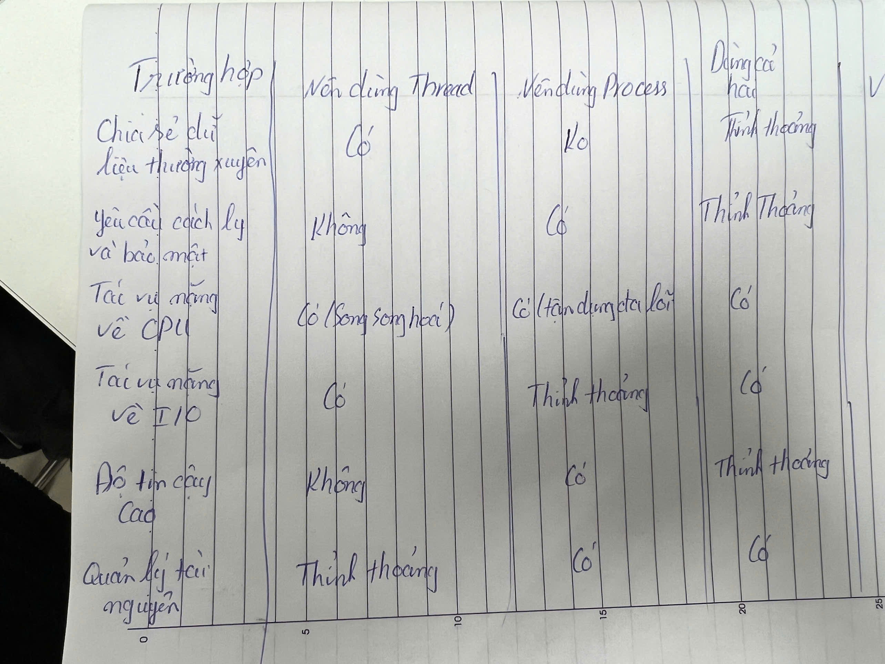

## Bài tập 1: ##

## Tên sản phẩm : Dell Vostro 5415 

## Thông số kỹ thuật

**CPU:** 8GB DDR4 (tốc độ 3200 MHz) 

**GPU:** AMD Radeon RX Vega 6 

**RAM:** 8GB DDR4 (tốc độ 3200 MHz)

**Lưu trữ:** 256GB SSD NVMe M.2

## Hiệu năng sản phẩm :

Dell Vostro 5415 là laptop tầm trung, thiết kế dành cho công việc văn phòng, học tập và giải trí cơ bản. Đủ mạnh để xem video 4K, chơi các game nhẹ (như CS:GO, Dota 2 ở cài đặt thấp), nhưng không phù hợp cho game nặng hoặc đồ họa chuyên sâu.

---

## Bài tập 2: 

Dưới đây là 12 bài toán phổ biến trong ngành Công nghệ Thông tin (CNTT), cùng với cách chúng sử dụng **đa luồng (multithreading)** hoặc **đa tiến trình (multiprocessing)**:

1. **Web Servers**  
   - **Ứng dụng đa luồng**: Xử lý đồng thời nhiều yêu cầu HTTP từ người dùng. Ví dụ: Apache dùng thread để phục vụ nhiều client cùng lúc.

2. **Database Servers**  
   - **Ứng dụng đa luồng/đa tiến trình**: Xử lý nhiều truy vấn SQL song song. Ví dụ: MySQL dùng thread hoặc process để xử lý truy vấn từ nhiều ứng dụng.

3. **Video Games**  
   - **Ứng dụng đa luồng**: Một thread cho render đồ họa, một thread cho tính toán vật lý, một thread cho xử lý đầu vào người chơi.

4. **Scientific Simulations**  
   - **Ứng dụng đa tiến trình**: Chạy mô phỏng phức tạp (như mô phỏng khí hậu) trên nhiều CPU. Ví dụ: Dùng OpenMPI (trang 1 tài liệu) để phân chia công việc.

5. **Machine Learning**  
   - **Ứng dụng đa tiến trình/đa luồng**: Huấn luyện mô hình trên dữ liệu lớn. Ví dụ: TensorFlow dùng đa GPU/process để tính toán gradient.

6. **File Compression**  
   - **Ứng dụng đa luồng**: Nén/giải nén file nhanh hơn. Ví dụ: WinRAR chia file lớn thành nhiều phần và xử lý song song bằng thread.

7. **Image Processing**  
   - **Ứng dụng đa luồng**: Áp dụng bộ lọc hoặc chỉnh sửa ảnh. Ví dụ: Photoshop dùng thread để xử lý từng vùng ảnh.

8. **Web Browsers**  
   - **Ứng dụng đa tiến trình**: Mỗi tab chạy trong một process riêng để tránh crash toàn bộ. Ví dụ: Chrome dùng thread trong process cho giao diện và tải dữ liệu.

9. **Operating Systems**  
   - **Ứng dụng đa tiến trình/đa luồng**: Quản lý ứng dụng bằng process, xử lý tác vụ hệ thống bằng thread. Ví dụ: Windows chạy File Explorer và Task Manager trong các process riêng.

10. **Compilers**  
    - **Ứng dụng đa luồng**: Biên dịch mã nguồn song song. Ví dụ: GCC dùng thread để tăng tốc biên dịch.

11. **Network Applications**  
    - **Ứng dụng đa luồng**: Xử lý nhiều kết nối mạng cùng lúc. Ví dụ: Ứng dụng chat dùng thread cho mỗi kết nối người dùng (thread-per-connection, trang 9).

12. **Real-time Systems**  
    - **Ứng dụng đa luồng**: Xử lý dữ liệu từ cảm biến với độ trễ thấp. Ví dụ: Hệ thống xe tự hành dùng thread cho camera và tín hiệu.

---

## Bài tập 3

### **Giải thích**
- **Thread**: Tốt khi cần chia sẻ dữ liệu nhanh (chung bộ nhớ), chi phí tạo thấp, phù hợp với I/O-bound tasks (như tải file, truy vấn mạng – trang 6).
- **Process**: Tốt cho cách ly (mỗi process có bộ nhớ riêng), tận dụng đa lõi CPU, phù hợp với CPU-bound tasks (như tính toán nặng – trang 5).
- **Cả hai**: Dùng trong hệ thống phức tạp, ví dụ: ứng dụng phân tán có nhiều process cho các dịch vụ (web, database), mỗi process dùng thread để xử lý yêu cầu (trang 7-8).

---

## **Bài tập 4:**

### **Báo cáo: Cách ChatGPT được huấn luyện bằng hệ thống phân tán**

Huấn luyện mô hình ngôn ngữ lớn như ChatGPT (do OpenAI phát triển) đòi hỏi xử lý dữ liệu khổng lồ và tính toán phức tạp, điều mà một máy đơn không thể thực hiện. Hệ thống phân tán (distributed systems) là giải pháp chính, được thực hiện như sau:

1. **Data Parallelism (Song song hóa dữ liệu)**  
   - Tập dữ liệu (hàng terabyte văn bản) được chia nhỏ và phân phối cho nhiều máy trong cụm (cluster).  
   - Mỗi máy tính toán gradient trên phần dữ liệu của mình, sau đó tổng hợp để cập nhật mô hình.  
   - Ví dụ: 100 GPU, mỗi GPU xử lý 1/100 dữ liệu.

2. **Model Parallelism (Song song hóa mô hình)**  
   - Mô hình lớn (hàng tỷ tham số) được chia thành nhiều phần, mỗi phần chạy trên một GPU riêng.  
   - Ví dụ: Layer 1-10 chạy trên GPU 1, Layer 11-20 trên GPU 2.

3. **Pipeline Parallelism (Song song hóa đường ống)**  
   - Mô hình chia thành các giai đoạn, mỗi giai đoạn chạy trên một máy, xử lý đồng thời và truyền kết quả qua lại.  
   - Giảm thời gian chờ và tăng hiệu quả tài nguyên.

4. **Công cụ và phần cứng**  
   - **Thư viện**: TensorFlow/PyTorch quản lý tính toán phân tán; Horovod đồng bộ gradient; OpenMPI (trang 1 tài liệu) hỗ trợ giao tiếp giữa các máy.  
   - **Lưu trữ**: Dùng HDFS hoặc AWS S3 cho dữ liệu lớn.  
   - **Phần cứng**: Hàng nghìn GPU/TPU (ví dụ: NVIDIA A100) trong cụm máy tính.

5. **Quy trình**  
   - Thu thập và làm sạch dữ liệu từ internet, sách, bài báo.  
   - Phân phối dữ liệu và mô hình cho các node.  
   - Huấn luyện song song, đồng bộ qua mạng.  
   - Tối ưu hóa bằng thuật toán như Adam.

### **Tham khảo**  
- OpenAI Blog: [https://openai.com/blog/](https://openai.com/blog/)  
- Bài báo: "Training Large Language Models" (tìm trên Google Scholar với từ khóa "distributed training large language models").

### **Kết luận**  
Hệ thống phân tán giúp ChatGPT xử lý dữ liệu lớn hiệu quả nhờ kết hợp data parallelism, model parallelism, và công nghệ hiện đại.

---

